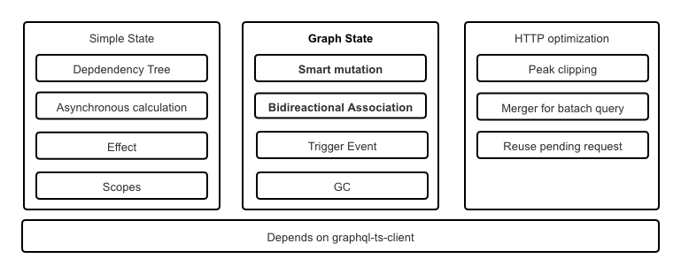

# A new react state management framework

## System functions



### 1. Simple State

A simple state management tool that looks similar to recoil, used to manage scattered data outside the business object model, and can be easily coordinated with the "Graph State".

### 2. Graph State

The core value of this framework is to provide graph state management capabilities that are far more intelligent than apollo-client and relay. This is also my motivation for creating this framework.

Graph state management supports two core functions: 
- Smart mutation
- Bidirectional association

#### 2.1 Smart Mutation

When using the traditional GraphQL client, the biggest pain developers face is the need to decide whether to update the local cache or requery the data after the change operation. If you choose to modify the local cache, you will face a heavy workload; if you choose to re-query, not only you need to accept the performance defects, but also it is not easy to determine which queries need to be re-executed.

The cache database built into this framework is highly intelligent. You only need to simply update it with the information returned by the server, and it will analyze the impact of the new data on the existing cache, and try to modify only the local cache; if this effort is not feasible, the current operation will be automatically upgraded to Re-query behavior and automatically find all queries that need to be re-executed.


Regardless of whether the framework chooses to modify only the local data(A), or re-query(B). They are all fully automatic and do not require your intervention.

However, you can also intervene in the decision-making process if you wish. You can use simple APIs to help it with performance optimization, increase the probability of occurrence (A) and decrease the probability of occurrence (B).

##### 2.1.1. When users do not optimize

Let's take a look at an example where the mutation cannot be completed by only modifying the local cache because the user does not optimize it. The GIF animation is as follows


When we changed "MANNING-1" to "MANNING-2", in the absence of user optimization, the two cache entries with parameters were cleared. Therefore, queries with parameters will automatically retrieve new data from the server again.

##### 2.1.1. 用户给予优化时

Let's take a look at an example where the change can be completed by modifying the local cache without re-query due to the support of user optimization. The GIF animation is as follows


当我们把"MANNING-1"修改成"MANNING-2"的时候，在用户优化的支持下，带参数的两个缓存项被直接更新，而不是被清除。所以，带参数的查询会马上呈现了最新结果，无需重新查询。

> 注意
> 
> - Query.findBooksStores()
> - Query.findBooksStores({name: "1"})
> - Query.findBooksStores({name: "2"})
> 
> 实际项目中，被UI抛弃的数据可能会在较短时间内被垃圾回收系统释放。在这个例子中，为了达到演示效果，故意调整了垃圾释放策略，让这三个数据都可以相对长时间地在缓存中同时存在。

#### 3.2. Bidirectonal association maintenance

Although from the perspective of a single UI component, one-way associations between objects are concerned. However, the cache is shared by all UI components, and the data of these components will be merged inside the cache, and finally a two-way association will inevitably appear in the cache. If the two-way association cannot be handled well, data inconsistency will occur between different components. In fact, the maintenance of two-way association is one of the foundations of the intelligence of this framework.

Bidirectonal association is supported and the symmetry of bidirectonal association is strictly guaranteed. Developers can modify one end of the  bidirectonal association at will. If the other end has been cached, the other one will be automatically updated to guarantee the symmetry of the association and the consistency of the data. 


#### 3.3. Database style trigger
The built-in cache database supports triggers. Not only does the framework use it internally to achieve the purpose of data intelligent maintenance, the triggers are also exposed as public APIs so that developers can customize more intelligent behaviors.


### 4. HTTP optimization

The framework has built-in optimization strategies to reduce the number of HTTP requests

1. Peak clipping: Users can quickly change the query conditions, but asynchronous requests will be sent out as slowly as possible. The system guarantees that the last HTTP request uses the parameters entered last time by the user.

2. Object/objects queries base on id/ids are easy to repeat between different UI components, if not optimized, it will lead to fragmentation of HTTP requests. As long as different components query object/objects by same shape, the id/ids parameters specified by different components will be merged together, and finally one merged batch request will be sent.

3. For multiple queries with the same variables but different shapes, queries with smaller shapes will not send out HTTP requests, they will borrow the HTTP request of the query with the largest shape to share the response data. Even if the HTTP request for the query with the largest shape has been sent and is in the pending state, this optimization is still effective.


### 5. Not only gobal state, but also scopes

This framework introduces scope similar to programming languages. In addition to the global scope, any react component can choose to open a child scope.

This design is useful for some states such as "selectedXXX"

## Run the example
1. Clone this project
```
git clone https://github.com/babyfish-ct/graphql-state.git
```
2. Start server
```
cd ${clonedDir}/example/server
yarn start
```
The server mock data in memory, when it's restarted, all the data will be restored.

3. Start client
```
cd ${clonedDir}/example/client
yarn start
```
Access http://localhost:3000

## Dependencies
1. React, version >= 17.0.0
2. [graphql-ts-client](https://github.com/babyfish-ct/graphql-ts-client), version >= 3.0.8

[graphql-ts-client](https://github.com/babyfish-ct/graphql-ts-client) is another framework created by me a few months ago, it's TypeScript-DSL for GraphQL with full features.

## Schedules

This is the first version 0.0.0, and there is still some work to be done in the future.

### Short-term goal
1. Doucment **(Emergency)**
2. Cascade deleting for non-null many-to-assocaition
3. Preload async state
4. Support RestNework for REST server

### Long-term goal
1. Transaction, save point, undo/redo 
2. Chrome extension for data visualization


## Change Log
|Version|Description|
|-------|-----------|
|0.0.1  |GC for built-in cache database|
|0.0.2  |Support usePaginationQuery| 
|0.0.3  |Smart-mutation became more smart|
|0.0.4  |Support releasePolicy|
