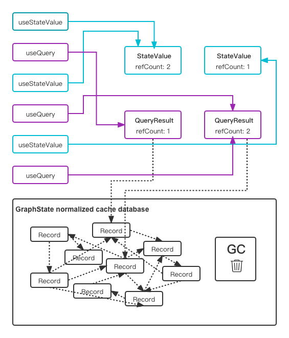

# [graphql-state](https://github.com/babyfish-ct/graphql-state)/[Documentation](./README.md)/Release Policy

# 1. Memory management strategy

The state relationship needs to consume the memory resources of the browser, and these precious resources need to be returned to the browser continuously, so that the website can run continuously

The memory structure of "graphql-state" is as follows



Divided into two parts

- Simple data can be managed by reference count
  - "useStateValue", "useStateAccessor" functions refer StateValue.
  - "useQuery", "usePaginationQuery", "useObject", "useObjects" functions refer QueryResult.
  
  > Although the computed state and asynchronous state let StateValue depends on other StateValue or QueryResult, these dependencies are a tree structure, not a graph structure, there is no problem of circular references. Therefore, for objects such as StateValue and QueryResult, reference counting memory management is feasible
  
  StateValue and QueryResult have a built-in reference count, the default is 0, and supports two internal operations
   - retain: add 1 to the reference count
   - release: Decrease the reference count by 1, if the result is 0, dipose the resource. Here we can choose not only to dispose immediately, but also to delay diposing. For delayed diposing, the data can be redeemed before the deadline is reached. The user can decide how to delay the diposing, this is the focus of this article.
  
  When different react component use the above hook to access data, if all the parameters are the same, they will share the same StateValue or QueryResult, otherwise they will get their own StateValue or QueryResult. In either case, follow the following rules
  - Retain the new data
  - If the data changes or the react component is unmount, release the old data.

  Once the reference count of a StateVale or QueryResult is reset to 0 by the release operation, it will be diposed immediately or delayed.
  
- The part that needs garbage collection

   The framework has a built-in cache database of graph data, like RDBMS, it stores normalized records. The inter-reference relationship between these records is intricate and complicated, and circular references often occur. For this part of the data, garbage collection strategies must be used.

   The StateValue and QueryResult objects managed by the reference count serve as the root references for the garbage collection algorithm. Whenever a StateValue or QueryResult is disposed, it will automatically trigger once GC. The user cannot intervene in the garbage collection process, it is not the focus of this article.
  
## 2. Delayed disposing

As mentioned above, the delayed disposing of StateValue and QueryResult can be intervened by the user. To interfere with this behavior, you need to specify a function

```ts
(aliveTime: number, variables: any) => number
```
**Parameters**
  - aliveTime:
    How long has the current StateValue/QueryResult survived since it was created until now, in milliseconds
  - variables:
    The parameters of the current StateValue/QueryResult, its the "options.variables" specified when the user calls the useStateValue, useStateAccessor, useQuery, usePaginationQuery, useObject, and useObjects functions.
    > - For each field inside "options.variables", if its value is "" and GraphQL schema does not require it to be non-null, the variable field is automatically regarded as undefined
    >- If all the fields inside "options.variables" are undefined or regarded as undefined, here the "variables" as a whole are undefined

**Return value**
  Delayed disposing waiting time, in milliseconds
  - If less than or equal to 0, dispose immediately
  - Otherwise, delayed disposing
    - During the waiting process, if the data is retained again, the data will be resurrected. Delayed disposing and waiting behavior are cancelled.
    - If the object is not resurrected during the waiting process, the current StateValue/QueryResult will be disposed. And trigger once garbage collection for the normalized data cache database.

### 2.1 Default release prolicy
```ts
(aliveTime: number, variables: any) => number {
    if (aliveTime < 1000) {
        return 0;
    }
    if (variables !== undefined) {
        return Math.min(aliveTime, 30_000);    
    }
    return Math.min(aliveTime, 60_000);
}
```
- For data whose survival time is less than one second, it will be released immediately
- Otherwise, the disposing will be delayed according to the survival time. The longer the survival time, the greater the value of the data, and the greater the meaning of resurrection. This is like hotter data that takes longer to cool down.
   - For data with parameters, the maximum delay shall not exceed half a minute
   - For data without parameters, the maximum delay shall not exceed 1 minute

### 2.2 Customize delayed diposing

1. Global Setting
  ```ts
  const myReleasePolicy = (aliveTime: number, variables: any) => {
      return ...;
  };
  <StateManagerProvider 
      stateManager={...}
      repesePolicy={myReleasePolicy}>
      ...
  </StateManagerProvider>
  ```
2. Single data setting (take only useStateValue and useQuery as examples)
  ```ts
  const myReleasePolicy = (aliveTime: number, variables: any) => {
      return ...;
  };
  useStateValue(asyncStyle, {
      repesePolicy: myReleasePolicy
  });
  useQuery(query$.findBooks(...), {
      repesePolicy: myReleasePolicy
  });
  ```

-----------
[< Previous：Graphq state](./graph-state/README.md) | [Back to parent：Documentation](./README.md) | [Next：HTTP optimization>](./http-optimization/README.md)
```
