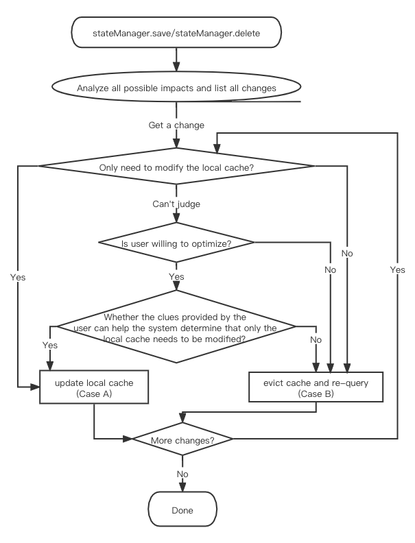
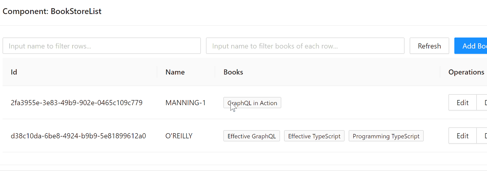
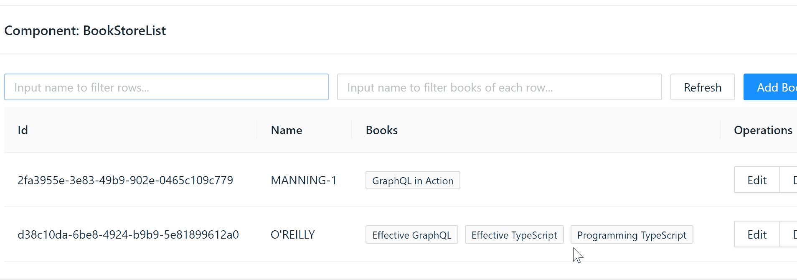
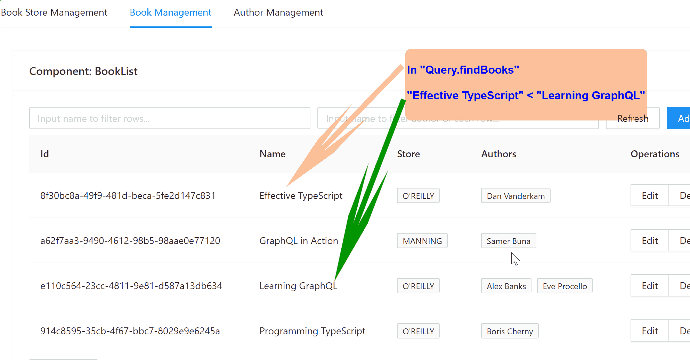
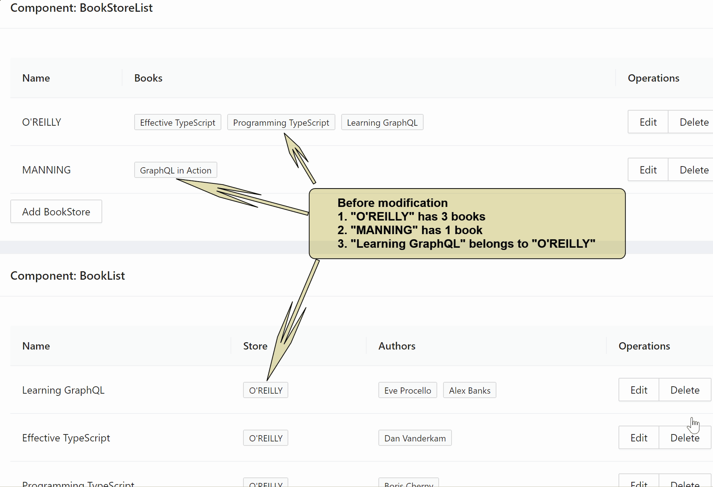

# System functions and GIF animation presentations


## 1. Simple State

A simple state management tool that looks similar to [recoil](https://github.com/facebookexperimental/Recoil), used to manage scattered data outside the business object model, and can be easily coordinated with the "Graph State".

## 2. Graph State

The core value of this framework
> One main mutation causes **N** extra mutations. The more complex the UI, the larger the **N**.

**The framework allows developers to focus only on the main changes, because extra mutations are handled automatically.**

Compare with [Apollo client](https://github.com/apollographql/apollo-client) and [Relay](https://github.com/facebook/relay), after mutation, you only need to save the main mutation into local cache. neither need to manually change other affected data in the local cache, nor need to specify which queries will be affected and need to be refetched, because of all the extra mutations is handled automatically


Graph state management supports two core functions: 
- Smart mutation
- Bidirectional association

### 2.1. Smart Mutation

When using the traditional GraphQL client, the biggest pain developers face is the need to decide whether to update the local cache or requery the data after the change operation. If you choose to modify the local cache, you will face a heavy workload; if you choose to re-query, not only you need to accept the performance defects, but also it is not easy to determine which queries need to be re-executed.

The cache database built into this framework is highly intelligent. You only need to simply update it with the information returned by the server, and it will analyze the impact of the new data on the existing cache, and try to modify only the local cache; if this effort is not feasible, the current operation will be automatically upgraded to re-query behavior and automatically find all queries that need to be refetched.



Regardless of whether the framework chooses to modify only the local data(A), or re-query(B). They are all fully automatic and do not require your intervention.

However, you can also intervene in the decision-making process if you wish. You can use simple APIs to help it with performance optimization, increase the probability of occurrence (A) and decrease the probability of occurrence (B).

#### 2.1.1. When user does not optimize

Let's take a look at an example where the mutation cannot be completed by only modifying the local cache because the user does not optimize it. The GIF animation is as follows

||
|---|

When we changed "MANNING-1" to "MANNING-2", in the absence of user optimization, the two cache entries with parameters were cleared. Therefore, queries with parameters will automatically retrieve new data from the server again.

#### 2.1.2. When user gives optimization

Let's take a look at an example where the change can be completed by modifying the local cache without re-query due to the support of user optimization. The GIF animation is as follows

||
|---|

When we change "MANNING-1" to "MANNING-2", with the support of user optimization, the two cache entries with parameters are directly updated instead of being cleared. Therefore, the query with parameters will immediately show the latest results, without the need to re-query.

> Notes，there are 3 cache items involved here
> 
> - Query.findBooksStores()
> - Query.findBooksStores({name: "1"})
> - Query.findBooksStores({name: "2"})
> 
> In actual projects, the data discarded by the UI may be released by the garbage collection system in a relatively short period of time. In this example, in order to achieve the demonstration effect, the garbage release strategy is deliberately adjusted so that all three data can exist in the cache for a relatively long time.

#### 2.1.3. Smart Sorting

As shown in the above GIF animation, graphql-state can automatically re-implement conditional filtering according to data changes. Not only that, graphql-state can also automatically re-sort according to data changes, as shown in the following GIF animation

||
|---|

In this example, we care about two associations
- Query.findBooks
- BookStore.books

Both of them are sorted in ascending order by name. Therefore, when the name of the object is modified, these two associations will be reordered.

> Smart sorting requires user optimization

### 2.2. Bidirectonal association maintenance

In the above, we showed a few cool effects. Not only that, graphql-state can also handle the interaction between different data associations. This is the bidirectional association maintenance.

Refer to such an example
- BookStore has a books field, it's an one-to-many association pointing to Book
- In turn, Book has a store field, it's a many-to-one association pointing to BookStore

From a business perspective, "BookStore.books" and "Book.store" are actually two sides of the same association due to different perspectives. Therefore, graphql-state allows you to bind these two associations into a bidirectional association. Once you have completed this binding, you can get the effect shown in the following GIF animation

||
|---|

In this example, the modification you performed is
```
MANNING.books.add(LearningGraphQL);
```
At the same time, graphql-state will perform two automatic updates for you
```
if (cached(O'REILLY.books)) {
    O'REILLY.books.remove(LearningGraphQL);
}
if (cached(LearningGraphQL.store)) {
    LearningGraphQL.store = MANNING;
}
```

### 2.3. Database style trigger
The built-in cache database supports triggers. Not only does the framework use it internally to achieve the purpose of data intelligent maintenance, the triggers are also exposed as public APIs so that developers can customize more intelligent behaviors.

### 2.4. Access REST service 

For existing REST services, the framework supports mapping REST services to GraphQL services on the client side, using GraphQL semantics, and enjoying  the syntactic sugar provided by [graphql-ts-client](https://github.com/babyfish-ct/graphql-ts-client)

## 3. HTTP optimization

The framework has built-in optimization strategies to reduce the number of HTTP requests

1. Peak clipping: Users can quickly change the query conditions, but asynchronous requests will be sent out as slowly as possible. The system guarantees that the last HTTP request uses the parameters entered last time by the user.

2. Object/objects queries base on id/ids are easy to repeat between different UI components, if not optimized, it will lead to fragmentation of HTTP requests. As long as different components query object/objects by same shape, the id/ids parameters specified by different components will be merged together, and finally one merged batch request will be sent.

3. For multiple queries with the same variables but different shapes, queries with smaller shapes will not send out HTTP requests, they will borrow the HTTP request of the query with the largest shape to share the response data. Even if the HTTP request for the query with the largest shape has been sent and is in the pending state, this optimization is still effective.

-------------

[Back to home](https://github.com/babyfish-ct/graphql-state)
